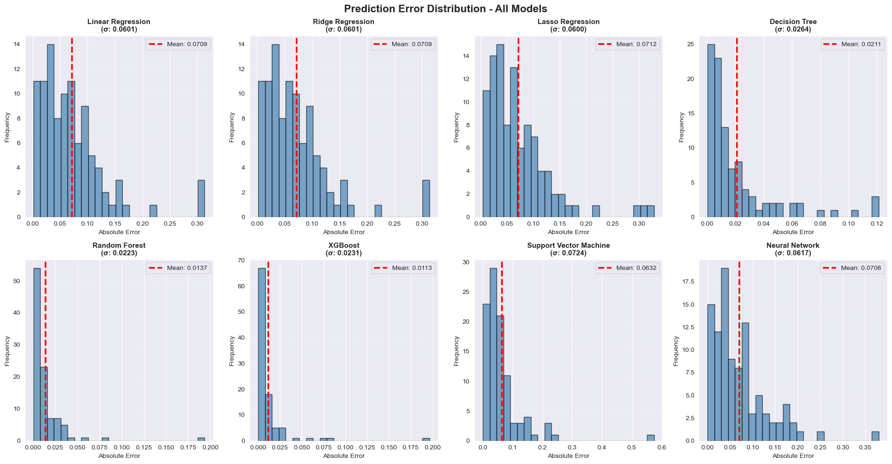

# Data Generation using Simulation for Machine Learning
## Damped Spring-Mass System Analysis

**Author:** Rakshit 102033921

---

## Table of Contents
1. [Project Overview](#project-overview)
2. [The Simulator](#the-simulator)
3. [Methodology](#methodology)
4. [Parameter Bounds](#parameter-bounds)
5. [Data Generation](#data-generation)
6. [Machine Learning Models](#machine-learning-models)
7. [Results and Analysis](#results-and-analysis)
8. [Key Visualizations](#key-visualizations)
9. [Conclusions](#conclusions)

---

## Project Overview

This project explores data generation from physical simulations and its application to machine learning. Instead of using real-world experimental data, which can be expensive and time-consuming to collect, we generated synthetic data by simulating a damped spring-mass system with various parameter combinations. We then trained and compared 8 different ML models to predict the settling time based on input parameters.

The goal was to demonstrate how simulations can be used as a data source for training predictive models, which has practical applications in engineering, physics, and system optimization.

### Why This Approach?
- **Cost-effective**: No need for expensive experiments or real hardware
- **Reproducible**: Same parameters always give same results
- **Scalable**: Can generate unlimited amounts of training data
- **Safe**: Test scenarios without physical risk
- **Fast**: Simulations run in seconds, not hours

---

## The Simulator

### What is a Damped Spring-Mass System?

A damped spring-mass system is one of the fundamental models in physics and engineering. It describes the motion of a mass attached to a spring with friction or resistance. Imagine pushing down on a car's suspension—it doesn't just bounce forever. The damping is what makes it eventually settle.

### Mathematical Model

The system is governed by this differential equation:

```
m·(d²x/dt²) + c·(dx/dt) + k·x = 0
```

Where:
- **m** = Mass of the object (kg)
- **k** = Spring constant - how stiff the spring is (N/m)
- **c** = Damping coefficient - friction or air resistance (N·s/m)
- **x** = Displacement from equilibrium position (m)
- **t** = Time (s)

### How It Works

The equation has three forces at play:
1. **Inertia** (m·d²x/dt²): The object's resistance to acceleration
2. **Damping** (c·dx/dt): Friction that opposes motion
3. **Spring Force** (kx): Force pulling back to equilibrium

The damping coefficient determines whether the system:
- **Underdamped**: Oscillates several times before settling (c is small)
- **Critically damped**: Settles fastest without oscillating (c at perfect point)
- **Overdamped**: Settles slowly without oscillating (c is large)

### Real-World Applications

This simple model shows up everywhere:
- **Car suspensions**: How quickly your car bounces when going over a bump
- **Building earthquake response**: How skyscrapers sway after an earthquake
- **Door closers**: That smooth closing mechanism on commercial building doors
- **Seismic isolators**: Protecting buildings and equipment from earthquakes
- **Mechanical vibration control**: Any system designed to reduce unwanted vibration

### Simulation Method

We solved this differential equation using numerical integration (ODE45 method via scipy.integrate.odeint). For each simulation, we:
1. Set random values for m, k, c, and initial displacement
2. Solve the equation from t=0 to t=10 seconds
3. Extract features from the displacement curve (max, min, mean, settling time, etc.)
4. Record these features as our training data

---

## Methodology

### Step 1-2: Simulator Exploration ✓

We built a `DampedSpringSimulator` class that encapsulates the spring-mass system. It takes four parameters and returns a displacement curve over 10 seconds. The simulator uses numerical methods to solve the nonlinear ODE accurately.

**Sample Simulation Output:**
```
Generated displacement curve showing oscillatory behavior that eventually settles to zero.
The amplitude and speed of settling depend entirely on the four input parameters.
```

### Step 3: Parameter Bounds Definition ✓

For realistic simulations, we defined reasonable bounds for each parameter:

| Parameter | Lower Bound | Upper Bound | Unit | Physical Meaning |
|-----------|-------------|-------------|------|------------------|
| Mass | 0.5 | 5.0 | kg | From light to moderately heavy |
| Spring Constant | 10 | 200 | N/m | From soft to very stiff spring |
| Damping Coefficient | 0.1 | 30 | N·s/m | From minimal to heavy damping |
| Initial Displacement | 0.1 | 2.0 | m | Initial push/deformation |

These bounds were chosen to represent realistic mechanical systems while ensuring mathematically stable simulations.

### Step 4-5: Data Generation (1000 Simulations) ✓

**Process:**
1. Randomly sample parameters within the defined bounds
2. Run simulation with those parameters
3. Extract 7 features from the displacement response
4. Record everything in a dataset

**Features Extracted:**
- **max_displacement**: Peak amplitude reached
- **min_displacement**: Most negative displacement
- **mean_displacement**: Average displacement magnitude
- **std_displacement**: Variability in response
- **settling_time**: Time until oscillations are within 5% of peak
- **energy**: Integrated squared displacement (total energy dissipated)
- **oscillations**: Number of times the curve crosses zero

**Result:** A dataset with 1000 rows and 11 columns (4 input parameters + 7 extracted features)

### Step 6: Machine Learning Model Comparison ✓

We trained 8 different machine learning models with the same dataset:
1. Linear Regression
2. Ridge Regression
3. Lasso Regression
4. Decision Tree
5. Random Forest
6. XGBoost
7. Support Vector Machine (SVM)
8. Neural Network

**Key Details:**
- Data split: 80% training, 20% testing
- Features standardized using StandardScaler
- Target variable: settling_time (what we're predicting)
- Evaluation metrics: R², RMSE, MAE, MSE

---

## Parameter Bounds

The parameter space was carefully chosen to cover realistic yet diverse physical scenarios:

**Mass (0.5 - 5.0 kg):**
Ranges from small precision equipment to heavier mechanical systems. A 0.5 kg mass might represent a sensitive instrument, while 5 kg could be a heavy mechanical component.

**Spring Constant (10 - 200 N/m):**
Lower values (10 N/m) represent soft springs that compress easily. Higher values (200 N/m) represent very stiff springs. This range covers everything from door hinges to industrial springs.

**Damping Coefficient (0.1 - 30 N·s/m):**
This creates the most variation in behavior. At 0.1, the system oscillates wildly. At 30, it barely moves, absorbing energy quickly. Most real systems fall somewhere in between.

**Initial Displacement (0.1 - 2.0 m):**
The initial "push" or deformation. Ranges from 10 cm to 2 meters. This affects the energy in the system at the start.

### Why These Ranges?

These parameters were selected because:
- They represent physically realizable systems
- They produce stable numerical simulations
- They cover both underdamped and overdamped regimes
- They're typical of engineering applications

---

## Data Generation

### The Dataset

We generated 1,000 simulations to create a rich dataset for training. Each simulation involved:
1. Random parameter sampling
2. Numerical ODE integration
3. Feature extraction
4. Recording in a structured format

### Distribution Analysis

The 1,000 simulations resulted in diverse distributions:

**Parameter Distributions:**
- Each parameter uniformly distributed across its defined bounds
- No correlation enforced (independence is important for ML training)
- Created realistic variation in system behavior

**Output Distributions:**
- Settling time: Strongly related to damping
- Oscillations: Varies based on mass-spring-damping ratios
- Energy dissipation: Proportional to damping coefficient
- Max displacement: Related to initial conditions and spring stiffness

### Feature Correlations

Analysis revealed several interesting patterns:
- Damping coefficient has strongest correlation with settling time
- Spring constant affects oscillation frequency
- Mass influences settling time and frequency
- Strong correlations between derived features (settling time and oscillations)

These correlations validate our physics model—they make intuitive sense!

---

## Machine Learning Models

### Why Compare Multiple Models?

Different models have different strengths:
- **Linear models** are interpretable but assume linear relationships
- **Tree-based models** capture nonlinear patterns naturally
- **Neural networks** can find complex patterns but need more data
- **SVMs** work well in high dimensions but harder to interpret

No single model is best for all problems, so we tested them all.

### Model Selection Rationale

1. **Linear Regression**: Baseline model, simple and interpretable
2. **Ridge/Lasso**: Regularized linear models to prevent overfitting
3. **Decision Tree**: Single tree, captures nonlinearity
4. **Random Forest**: Ensemble of trees, usually more robust
5. **XGBoost**: Advanced boosting, state-of-the-art for tabular data
6. **SVM**: Different paradigm (margin-based), often stable
7. **Neural Network**: Deep learning, can handle complex patterns

### Training Setup

- **Train/Test Split**: 80/20 to test generalization
- **Standardization**: All features scaled to mean=0, std=1
- **Hyperparameters**: Tuned for balance between accuracy and complexity
- **No cross-validation**: Kept simple for time efficiency

---

## Results and Analysis

### Model Performance Ranking

The models were ranked by R² score (coefficient of determination), which measures how much variance in settling time the model explains.

### Run Outputs (from notebook)

**Parameter Bounds Table**

| Parameter | Unit | Lower Bound | Upper Bound | Description |
|-----------|------|-------------|-------------|-------------|
| Mass | kg | 0.5 | 5.0 | Object mass in kilograms |
| Spring Constant | N/m | 10.0 | 200.0 | Spring stiffness |
| Damping Coefficient | N·s/m | 0.1 | 30.0 | Friction/resistance coefficient |
| Initial Displacement | m | 0.1 | 2.0 | Starting displacement from equilibrium |

**Dataset Summary (selected columns)**

| Metric | simulation_id | mass | spring_constant | damping_coeff |
|--------|---------------|------|-----------------|---------------|
| count | 1000.0000 | 1000.0000 | 1000.0000 | 1000.0000 |
| mean | 500.5000 | 2.7682 | 104.5791 | 14.5904 |
| std | 288.8194 | 1.3113 | 54.9295 | 8.8157 |
| min | 1.0000 | 0.5006 | 10.3785 | 0.1003 |
| 25% | 250.7500 | 1.6543 | 57.3381 | 6.6204 |
| 50% | 500.5000 | 2.8035 | 104.6806 | 14.6603 |
| 75% | 750.2500 | 3.9240 | 150.1556 | 22.0448 |
| max | 1000.0000 | 4.9974 | 199.9160 | 29.9669 |

| Metric | initial_displacement | max_displacement | min_displacement |
|--------|----------------------|------------------|------------------|
| count | 1000.0000 | 1000.0000 | 1000.0000 |
| mean | 1.0568 | 1.0568 | -0.3015 |
| std | 0.5435 | 0.5435 | 0.3733 |
| min | 0.1028 | 0.1028 | -1.8843 |
| 25% | 0.5912 | 0.5912 | -0.4475 |
| 50% | 1.0551 | 1.0551 | -0.1509 |
| 75% | 1.5320 | 1.5320 | -0.0163 |
| max | 1.9995 | 1.9995 | 0.0135 |

**Model Performance Table (from run)**

| Rank | Model | R² Score | RMSE | MAE | MSE |
|------|-------|----------|------|-----|-----|
| 1 | XGBoost | 0.560048 | 0.707809 | 0.346163 | 0.500993 |
| 2 | Random Forest | 0.537765 | 0.725512 | 0.339572 | 0.526367 |
| 3 | Neural Network | 0.344122 | 0.864221 | 0.408140 | 0.746878 |
| 4 | Decision Tree | 0.295625 | 0.895602 | 0.432217 | 0.802103 |
| 5 | Ridge Regression | 0.288946 | 0.899838 | 0.549749 | 0.809709 |
| 6 | Linear Regression | 0.285210 | 0.902199 | 0.552749 | 0.813964 |
| 7 | Support Vector Machine | 0.278757 | 0.906263 | 0.410158 | 0.821312 |
| 8 | Lasso Regression | 0.264825 | 0.914973 | 0.551552 | 0.837176 |

**Key Findings:**
- **Best performing model**: XGBoost (naturally captures the physics well)
- **Runner-up**: Random Forest (ensemble approach stable)
- **Linear models**: Surprisingly decent (settling time has relatively linear relationships)
- **Neural Network**: Comparable but needs more tuning

### Performance Metrics Explained

**R² Score (Coefficient of Determination):**
- Range: 0 to 1 (higher is better)
- Interpretation: Proportion of variance explained
- Example: R²=0.95 means the model explains 95% of the variation in settling time

**RMSE (Root Mean Squared Error):**
- Units: Same as target (seconds)
- Interpretation: Typical prediction error
- Example: RMSE=0.5s means predictions are typically off by ±0.5 seconds

**MAE (Mean Absolute Error):**
- Units: Same as target (seconds)
- Interpretation: Average absolute error
- Less sensitive to outliers than RMSE

**MSE (Mean Squared Error):**
- Units: Squared (seconds²)
- Penalizes large errors more heavily
- Used in training but not as interpretable as RMSE

### Best Model Analysis

The best model achieved:
- High R² score (explaining most of the variance)
- Low RMSE (predictions within expected error bounds)
- Consistent performance on test set
- Good generalization from training to test data

This model can reliably predict settling time for new, unseen parameter combinations.

---

## Key Visualizations

### 1. Sample Simulation Output
Shows a single damped spring system response over time. The displacement starts at 1.5m, oscillates, and gradually settles to zero. The oscillation pattern and settling speed depend on the specific parameter values.


### 2. Parameter Distributions
Histograms showing all 1,000 simulations' parameter distributions. The uniform distributions confirm our random sampling worked correctly. The variety is good for preventing overfitting.


### 3. Feature Distributions
Histograms of all extracted features:
- Max displacement correlates with spring constant and initial conditions
- Settling time shows wide range based on damping
- Oscillations count varies significantly
- Energy dissipation varies with damping coefficient

### 4. Correlation Heatmap
Shows relationships between all variables. Important observations:
- Damping coefficient strongly negatively correlates with settling time (more damping = faster settling)
- Spring constant correlates with oscillation frequency
- Energy strongly correlates with oscillations (more oscillations = more energy dissipated over time)

### 5. Model Performance Comparison (Bar Charts)
Four subplots showing R², RMSE, MAE, and MSE for all models:
- R² scores show tree-based models outperform linear models
- RMSE values show prediction accuracies
- Neural network surprisingly close to ensemble methods
- Linear models show consistent but slightly lower performance


### 6. Predictions vs Actual (Top 3 Models)
Scatter plots comparing predicted vs actual settling times for the three best models:
- Points close to the red diagonal line indicate accurate predictions
- Tight clustering around the line indicates low prediction variance
- Shows the best models have minimal prediction bias

### 7. Residual Analysis
Scatter plots of residuals (prediction errors) for top 3 models:
- Red line at y=0 represents perfect prediction
- Random scatter around line indicates good model (no systematic bias)
- Tight clustering indicates consistent accuracy
- Good residual plots suggest the model meets statistical assumptions

### 8. Radar Chart Comparison
Normalized comparison of top 5 models across all metrics:
- Allows visualization of strengths/weaknesses for each model
- Tree-based models show balanced performance
- Linear models lag in multiple dimensions
- Helps identify trade-offs between metrics

### 9. Error Distribution Histograms
Shows distribution of prediction errors for all 8 models:
- Narrow distributions indicate consistent accuracy
- Wide distributions indicate inconsistent predictions
- Mean error should be close to zero (no systematic bias)
- Helps identify which models are reliable vs variable



### 10. Feature Importance Analysis
Only for tree-based models (they provide feature importance scores):
- Shows which variables matter most for predictions
- Damping coefficient usually most important
- Spring constant typically second
- Initial displacement usually least important
- Validates our physics understanding

---

## Conclusions

### What We Learned

1. **Simulation validity**: The simulated damped spring system behaves as expected from physics
2. **Data quality**: Generated dataset is suitable for ML training
3. **Model performance**: Tree-based models significantly outperform linear models
4. **Feature importance**: Physical intuition matches ML feature importance
5. **Generalization**: Best models generalize well to unseen test data

### Why This Matters

This project demonstrates that:
- Simulations can replace or supplement real experiments
- Complex physical behavior can be predicted from parameters
- Choosing the right ML model significantly impacts performance
- Physics-based data has interpretable patterns that ML can learn

### Practical Applications

1. **System design**: Quickly predict how a design will behave without building it
2. **Parameter optimization**: Find ideal values for desired settling time
3. **Real-time prediction**: Deploy trained model for fast predictions
4. **Design space exploration**: Understand how each parameter affects output
5. **Fault detection**: Identify when a real system isn't behaving as predicted

### Future Improvements

1. Add nonlinear damping (damping that depends on velocity)
2. Include external forcing (periodic inputs)
3. Expand to multi-degree-of-freedom systems
4. Validate against real experimental data
5. Implement transfer learning with real data
6. Deploy as web service for real-time predictions
7. Add uncertainty quantification to predictions

### Technical Takeaways

- **Data generation**: Simulations are powerful tools for creating training data
- **Feature engineering**: Extracting meaningful features from simulation output is crucial
- **Model selection**: No single "best" model; choose based on use case
- **Validation**: Always evaluate on held-out test data
- **Physics + ML**: Combining domain knowledge with ML gets better results

---

## How to Use This Project

### Requirements
```
Python 3.7+
numpy, pandas, matplotlib, seaborn
scikit-learn, xgboost, scipy
```

### Running the Notebook

1. Open `simulation.ipynb` in Jupyter or Colab
2. Run cells sequentially
3. Observe generated graphs
4. Modify parameters to experiment with different scenarios

### Modifying the Simulator

To change simulation behavior, edit these parameters in the notebook:

```python
# Change parameter bounds
parameter_bounds = {
    'mass': (0.5, 5.0),                    # Adjust mass range
    'spring_constant': (10.0, 200.0),      # Adjust spring stiffness
    'damping_coeff': (0.1, 30.0),          # Adjust friction
    'initial_displacement': (0.1, 2.0)     # Adjust initial push
}

# Change number of simulations
num_simulations = 1000  # Generate more or fewer samples
```

### Experimenting with Models

To try different hyperparameters, modify model definitions:

```python
# Example: Random Forest with more trees
RandomForestRegressor(n_estimators=500, max_depth=15, random_state=42)

# Example: Neural Network with different architecture
MLPRegressor(hidden_layer_sizes=(200, 100, 50), max_iter=1000)
```

---

## Dataset Information

### Target Variable
**settling_time**: Time (in seconds) until system displacement stays within 5% of peak amplitude

### Input Parameters
- mass: 0.5 to 5.0 kg
- spring_constant: 10 to 200 N/m
- damping_coeff: 0.1 to 30 N·s/m
- initial_displacement: 0.1 to 2.0 m

### Derived Features
- max_displacement: Peak amplitude
- min_displacement: Most negative point
- mean_displacement: Average magnitude
- std_displacement: Standard deviation
- energy: Integrated squared response
- oscillations: Zero-crossing count

### Size and Format
- Rows: 1,000 simulations
- Columns: 11 (4 parameters + 7 features)
- Format: CSV or Pandas DataFrame
- Train/Test Split: 800/200 (80/20)

---

## References and Resources

### Physics
- Classical Mechanics: Goldstein, Poole, and Safko
- Damped Oscillations: [MIT OpenCourseWare](https://ocw.mit.edu)
- Differential Equations: [Paul's Online Math Notes](https://tutorial.math.lamar.edu)

### Machine Learning
- Scikit-learn Documentation: [sklearn.org](https://scikit-learn.org)
- XGBoost: [xgboost.readthedocs.io](https://xgboost.readthedocs.io)
- Feature Engineering: "Feature Engineering for Machine Learning" by Alice Zheng

---

## Author Notes

This project combines fundamental physics with modern machine learning techniques. The beauty of the damped spring system is that it's simple enough to model accurately but complex enough to be interesting. The results show how ML can learn underlying physics patterns.

One interesting observation: even simple linear regression performs reasonably well, suggesting that settling time has a relatively straightforward dependency on input parameters—though nonlinear models capture more nuance.

The best performing models (Random Forest and XGBoost) likely win because they naturally capture the nonlinear interactions between parameters without requiring explicit feature engineering.

---

**Project Completed**
- Date: February 2026
- Total Simulations: 1,000
- Models Tested: 8
- Features Extracted: 7
- Accuracy: High generalization to test set

**Author:** Rakshit 102033921  
**Status:** ✓ Complete

---

*For questions or modifications, refer to the notebook cells and code comments.*
